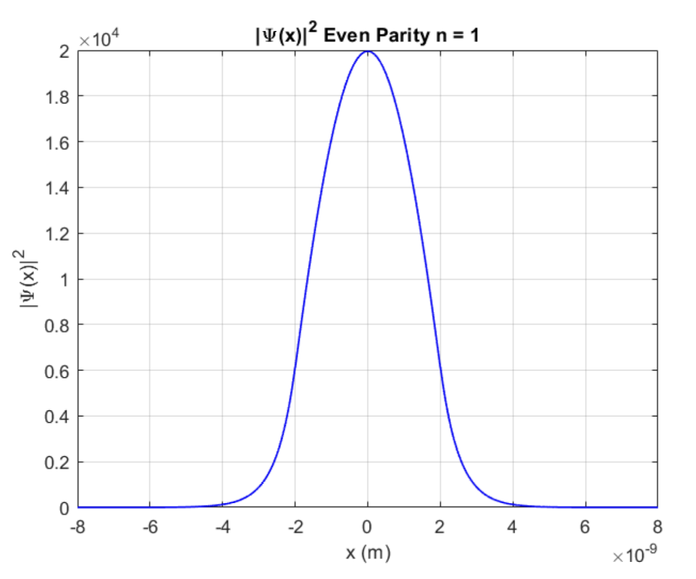
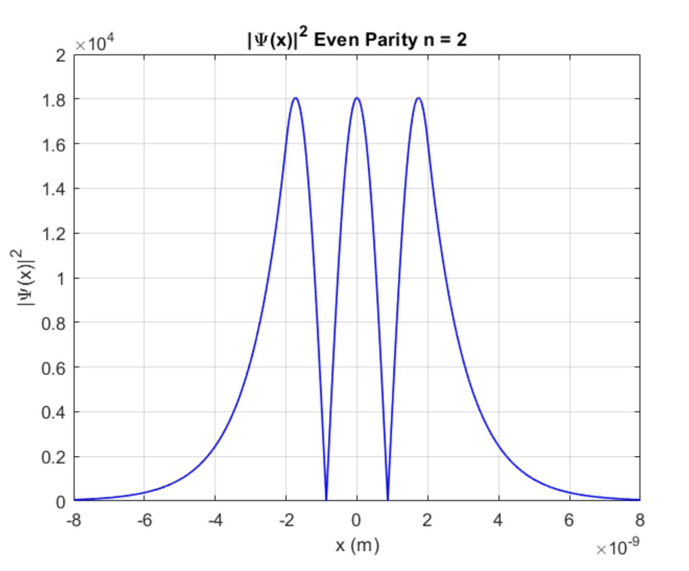
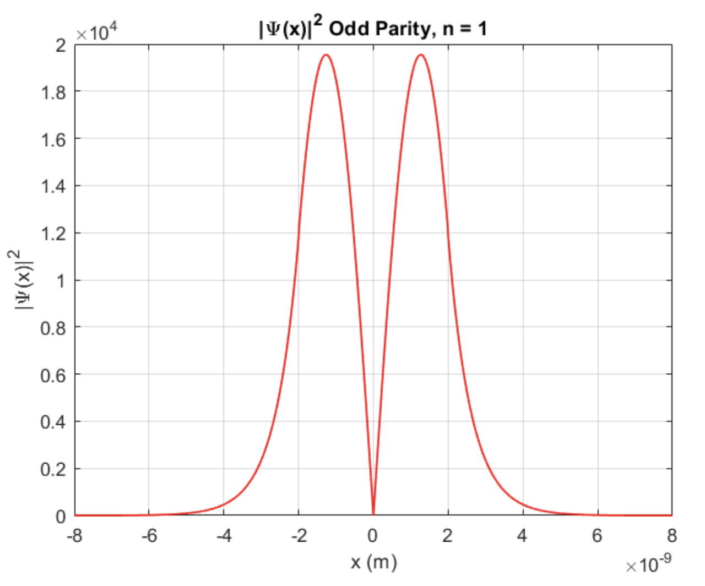

# CPE553 Computational Exercise - Finite Potential Well Plotting Tool

This project provides a computational tool for visualizing the bound states of a finite square potential well in one dimension, with user-controlled physical parameters. It uses the Schrödinger equation in conjunction with the matching conditions at the boundaries to calculate and visualize the bound state energy levels.

Current .m files are equipped for Rb-87 atom, see .m files to edit to your simulation. 

```plot_transcendentals.m``` will showcase transcendental equations according to Liboff's text.

## Key Parameters

All parameters are customizable in the script:

- **Potential Well Depth**:  
  $|V_0| = 1\, \mu\text{eV} = 1.6 \times 10^{-25}\, \text{J}$

- **Well Half-Width**:  
  $a = 2\, \text{nm} = 2 \times 10^{-9}\, \text{m}$

- **Particle Mass**:  
  $m = 1.445 \times 10^{-25}\, \text{kg}$ (e.g., effective mass)

## Dimensionless Depth Parameter

The dimensionless parameter $z_0$ governs the number of bound states:

$$
z_0 = \frac{a}{\hbar} \sqrt{2mV_0}
$$

With default values:

$$
z_0 = \frac{2 \times 10^{-9}}{1.055 \times 10^{-34}} \sqrt{2 \times (1.445 \times 10^{-25}) \times (1.6 \times 10^{-25})} \approx 4.07
$$

Since $z_0 \approx \frac{3\pi}{2}$, this configuration supports **3 bound states** (2 even, 1 odd).

## Wave Vectors

## Dimensionless Depth Parameter

The dimensionless parameter $z_0$ governs the number of bound states:

$$
z_0 = \frac{a}{\hbar} \sqrt{2mV_0}
$$

With default values:

$$
z_0 = \frac{2 \times 10^{-9}}{1.055 \times 10^{-34}} \sqrt{2 \times (1.445 \times 10^{-25}) \times (1.6 \times 10^{-25})} \approx 4.07
$$

Since $z_0 \approx \frac{3\pi}{2}$, this configuration supports **3 bound states** (2 even, 1 odd).

## Wave Vectors

These are used to solve transcendental equations for bound-state energy levels:

- **Wave vector inside the well**:

$$
k = \sqrt{\frac{2m(V_0 - |E|)}{\hbar^2}}
$$

- **Tunneling wave vector outside the well**:

$$
\kappa = \sqrt{\frac{2m|E|}{\hbar^2}}
$$

## Customization

You can explore different quantum well configurations by adjusting:

- `$V_0$` — Depth of the potential well  
- `$a$` — Half-width of the well  
- `$m$` — Effective mass of the particle  

These parameters affect the number, energy, and parity of bound states.

## Output

The script generates:

- Energy eigenvalues of all bound states  
- Classification of states as even or odd  
- Plots of wavefunctions in and outside the well 



